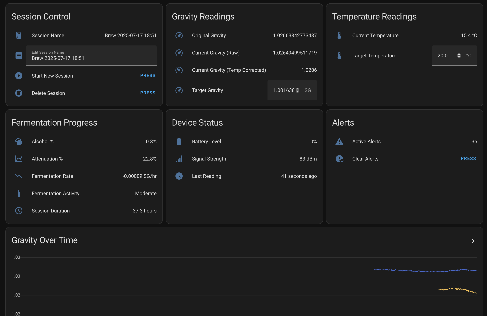

# RAPT Brewing Session Manager

[](https://github.com/sbaird123/rapt-brewing-hacs/releases)
[](https://github.com/sbaird123/rapt-brewing-hacs/commits/main)
[](LICENSE)
[](https://github.com/hacs/integration)

A Home Assistant integration for monitoring brewing sessions with RAPT Pill hydrometers via Bluetooth.



*Live dashboard showing a low-alcohol beer fermentation in progress with real-time gravity, temperature, and fermentation metrics.*

## Features

### 🍺 Brewing Session Monitoring
- **Simple Session Control**: Start new session, delete, and rename
- **Auto-Detection**: Automatically sets original gravity from first reading
- **Target Setting**: Set target gravity and temperature for calculations

### 📊 Advanced Brewing Calculations
- **Automatic ABV**: Real-time alcohol percentage calculation with temperature correction
- **Attenuation Tracking**: Monitor apparent attenuation percentage
- **Fermentation Rate**: Track gravity change over time (SG points per hour)
- **Temperature Correction**: Accurate gravity readings compensated for temperature

### 🔔 Smart Brewing Alerts
- **Stuck Fermentation**: Automatically detects when fermentation stalls
- **Temperature Monitoring**: High/low temperature warnings
- **Completion Detection**: Notification when target gravity is reached
- **Low Battery**: Alerts when RAPT Pill battery drops below 20%

### 📈 Comprehensive Data Monitoring
- **20+ Sensors**: Complete brewing data coverage including accelerometer and fermentation activity
- **Real-time Updates**: Live gravity, temperature, and device status
- **BLE Integration**: Direct Bluetooth Low Energy communication with RAPT Pill
- **Dashboard Ready**: Complete Lovelace configuration included

## Installation

### HACS (Recommended)

1. Open HACS in Home Assistant
2. Click on "Integrations"
3. Click the three dots in the top right corner
4. Select "Custom repositories"
5. Add repository URL: `https://github.com/sbaird123/rapt-brewing-hacs`
6. Select category: "Integration"
7. Click "Add"
8. Find "RAPT Brewing Session Manager" in HACS and install
9. Restart Home Assistant

### Manual Installation

1. Download the latest release from the [releases page][releases]
2. Extract the `rapt_brewing` folder to your `custom_components` directory
3. Restart Home Assistant

## Configuration

### Prerequisites
- Home Assistant version 2023.9.0 or later
- Bluetooth integration enabled in Home Assistant
- RAPT Pill hydrometer device
- ESPHome BLE proxy devices (recommended for better range and reliability)

### Setup Steps
1. **Enable Bluetooth** in Home Assistant (if not already enabled)
2. **Power on your RAPT Pill** and ensure it's in Bluetooth mode
3. Go to **Settings** → **Devices & Services** → **Add Integration**
4. Search for **"RAPT Brewing Session Manager"**
5. The integration will **automatically discover** your RAPT Pill via Bluetooth
6. Select your device from the list or enter manually if not found
7. Click **Submit** to complete setup

### Bluetooth Setup
- Ensure your RAPT Pill is powered on and transmitting
- The device should be within Bluetooth range of your Home Assistant instance
- If not automatically discovered, you can enter the device MAC address manually

## Usage

### Starting Your First Session
1. Use the "Start New Session" button (automatically stops any existing session)
2. Session automatically created with timestamp name (e.g., "Brew 2025-01-17 18:30")
3. Customize session name using the Session Name text input
4. Set brewing parameters using number inputs:
   - **Original Gravity**: Starting gravity (auto-detected from first reading)
   - **Target Gravity**: Expected final gravity
   - **Target Temperature**: Ideal fermentation temperature

### Monitoring Progress
- **Real-time Readings**: Current gravity, temperature, battery level
- **Calculated Metrics**: ABV%, attenuation%, fermentation rate
- **Historical Charts**: Gravity and temperature trends over time
- **Alert System**: Automatic alerts for stuck fermentation, temperature issues, and low battery

### Session Controls
- **Single Session Focus**: One active session at a time for simplicity
- **Session Naming**: Customize session names during brewing
- **Target Setting**: Set original gravity, target gravity, and target temperature

## Dashboard Configuration

The integration provides a comprehensive brewing dashboard with real-time monitoring:

The dashboard shows:
- **Session Control**: Start/stop sessions, edit names, and delete sessions
- **Gravity Readings**: Raw and temperature-corrected gravity values
- **Temperature Monitoring**: Current and target temperatures
- **Fermentation Progress**: Alcohol percentage, attenuation, and fermentation activity
- **Device Status**: Battery level, signal strength, and connection status
- **Alerts**: Active alerts with clear button
- **Historical Charts**: Gravity trends over time showing fermentation progress

### Setup Instructions

Copy the complete configuration from `dashboard_config.yaml` to create this dashboard:

```yaml
# RAPT Brewing Dashboard Configuration
# Copy this configuration to your Home Assistant Lovelace dashboard

type: vertical-stack
cards:
  # Top Row - Logically grouped measurements
  - type: horizontal-stack
    cards:
      - type: entities
        title: Session Control
        entities:
          - entity: sensor.rapt_brewing_session_manager_session_name
            name: Session Name
          - entity: text.rapt_brewing_session_manager_session_name
            name: Edit Session Name
          - entity: button.rapt_brewing_session_manager_start_new_session
            name: Start New Session
          - entity: button.rapt_brewing_session_manager_delete_current_session
            name: Delete Session
        show_header_toggle: false
      - type: entities
        title: Gravity Readings
        entities:
          - entity: sensor.rapt_brewing_session_manager_original_gravity
            name: Original Gravity
          - entity: sensor.rapt_brewing_session_manager_current_gravity
            name: Current Gravity (Raw)
          - entity: sensor.rapt_brewing_session_manager_current_gravity_temp_corrected
            name: Current Gravity (Temp Corrected)
          - entity: number.rapt_brewing_session_manager_target_gravity
            name: Target Gravity
        show_header_toggle: false
      - type: entities
        title: Temperature Readings
        entities:
          - entity: sensor.rapt_brewing_session_manager_current_temperature
            name: Current Temperature
          - entity: number.rapt_brewing_session_manager_target_temperature
            name: Target Temperature
        show_header_toggle: false

  # Second Row - Progress and device info
  - type: horizontal-stack
    cards:
      - type: entities
        title: Fermentation Progress
        entities:
          - entity: sensor.rapt_brewing_session_manager_alcohol_percentage
            name: Alcohol %
          - entity: sensor.rapt_brewing_session_manager_attenuation
            name: Attenuation %
          - entity: sensor.rapt_brewing_session_manager_fermentation_rate
            name: Fermentation Rate
          - entity: sensor.rapt_brewing_session_manager_fermentation_activity
            name: Fermentation Activity
          - entity: sensor.rapt_brewing_session_manager_session_duration
            name: Session Duration
        show_header_toggle: false
      - type: entities
        title: Device Status
        entities:
          - entity: sensor.rapt_brewing_session_manager_rapt_pill_battery
            name: Battery Level
          - entity: sensor.rapt_brewing_session_manager_rapt_pill_signal
            name: Signal Strength
          - entity: sensor.rapt_brewing_session_manager_last_reading_time
            name: Last Reading
        show_header_toggle: false
      - type: entities
        title: Alerts
        entities:
          - entity: sensor.rapt_brewing_session_manager_active_alerts
            name: Active Alerts
          - entity: button.rapt_brewing_session_manager_clear_alerts
            name: Clear Alerts
        show_header_toggle: false

  # Charts - Full width
  - type: history-graph
    title: Gravity Over Time
    entities:
      - entity: sensor.rapt_brewing_session_manager_current_gravity
        name: Current Gravity (Raw)
      - entity: sensor.rapt_brewing_session_manager_current_gravity_temp_corrected
        name: Current Gravity (Temp Corrected)
      - entity: sensor.rapt_brewing_session_manager_target_gravity
        name: Target Gravity
    hours_to_show: 168
    refresh_interval: 300

  - type: history-graph
    title: Temperature Over Time
    entities:
      - entity: sensor.rapt_brewing_session_manager_current_temperature
        name: Current Temperature
      - entity: sensor.rapt_brewing_session_manager_target_temperature
        name: Target Temperature
    hours_to_show: 168
    refresh_interval: 300

  - type: history-graph
    title: Alcohol Content Over Time
    entities:
      - entity: sensor.rapt_brewing_session_manager_alcohol_percentage
        name: Alcohol %
    hours_to_show: 168
    refresh_interval: 300

  - type: history-graph
    title: Attenuation Progress
    entities:
      - entity: sensor.rapt_brewing_session_manager_attenuation
        name: Attenuation %
    hours_to_show: 168
    refresh_interval: 300
```

**How to add to your dashboard:**
1. In Home Assistant, go to **Settings** → **Dashboards** → **Your Dashboard**
2. Click **Edit Dashboard** → **Add Card** → **Manual**
3. Copy and paste the complete YAML above
4. Click **Save**

## Available Sensors

### Core Brewing Sensors
| Sensor | Description | Unit |
|--------|-------------|------|
| `session_name` | Current session name | - |
| `original_gravity` | Starting gravity | SG |
| `current_gravity` | Current specific gravity (raw) | SG |
| `current_gravity_temp_corrected` | Temperature-corrected gravity | SG |
| `target_gravity` | Target final gravity | SG |
| `alcohol_percentage` | Calculated alcohol by volume | % |
| `attenuation` | Apparent attenuation | % |
| `fermentation_rate` | Gravity change rate | SG/hr |
| `current_temperature` | Current temperature | °C |
| `target_temperature` | Target fermentation temperature | °C |

### Device & Status Sensors
| Sensor | Description | Unit |
|--------|-------------|------|
| `battery_level` | RAPT Pill battery level | % |
| `signal_strength` | BLE signal strength | dBm |
| `session_duration` | Total session time | hours |
| `last_reading_time` | Last sensor reading timestamp | timestamp |
| `active_alerts` | Number of active alerts | count |

### Advanced Sensors
| Sensor | Description | Unit |
|--------|-------------|------|
| `gravity_velocity` | Official RAPT gravity velocity | SG/day |
| `accelerometer_x` | X-axis acceleration | g |
| `accelerometer_y` | Y-axis acceleration | g |
| `accelerometer_z` | Z-axis acceleration | g |
| `device_stability` | Device stability classification | - |
| `fermentation_activity` | Fermentation activity level | - |
| `firmware_version` | RAPT Pill firmware version | - |
| `device_type` | Device type information | - |
| `data_format_version` | BLE data format version | - |

## Alerts & Notifications

### Alert Types
- **Stuck Fermentation**: No gravity change for 48+ hours
- **Temperature High**: Above 30°C (86°F)
- **Temperature Low**: Below 10°C (50°F)
- **Fermentation Complete**: Target gravity reached
- **Low Battery**: Below 20%

### Notification Configuration
Alerts automatically create Home Assistant persistent notifications in the UI. For external notifications:

#### ✅ Built-in Notification Service (Recommended - Easy!)
First, ensure you have a notification service configured (mobile app, Telegram, email, etc.). Then:

1. Go to **Settings** → **Devices & Services** → **RAPT Brewing Session Manager**
2. Click **Configure**
3. Select your notification service from the dropdown (e.g., `notify.mobile_app_your_phone`)
4. Click **Submit**

**Done!** The integration automatically sends alerts to your chosen notification service with rich data including alert type, session name, and brewing status.

**Popular notification services to set up first:**
- **Mobile App**: Install Home Assistant Companion app
- **Telegram**: Configure `telegram_bot` and `notify.telegram`
- **Email**: Set up `notify.smtp`
- **Discord**: Configure `notify.discord`
- **Ntfy.sh**: Configure `notify.rest` for ntfy.sh (see below)

#### ⚠️ Custom Automations (Advanced Users Only)
The built-in notification service is much easier, but if you need custom automation logic, you can create automations that trigger on alert changes. This requires writing YAML automations and is more complex to maintain.

**Example: Custom Alert Automation**
```yaml
automation:
  - alias: "RAPT Brewing Custom Alert"
    trigger:
      - platform: state
        entity_id: sensor.rapt_brewing_session_manager_active_alerts
    condition:
      - condition: template
        value_template: "{{ states('sensor.rapt_brewing_session_manager_active_alerts') | int > 0 }}"
    action:
      - service: notify.your_notification_service
        data:
          title: "🍺 RAPT Brewing Alert"
          message: "{{ state_attr('sensor.rapt_brewing_session_manager_active_alerts', 'alerts')[0].message }}"
```

**Why use the built-in service instead?** No YAML editing, no template debugging, no maintenance. Just click configure and select your service!

### Ntfy.sh Configuration

[Ntfy.sh](https://ntfy.sh) is a simple pub-sub notification service. Here's how to set it up:

#### Step 1: Configure ntfy.sh in Home Assistant

Add to your `configuration.yaml`:

```yaml
notify:
  - name: ntfy_brewing
    platform: rest
    resource: https://ntfy.sh/your-unique-topic-name
    method: POST_JSON
    headers:
      Title: "🍺 RAPT Brewing Alert"
      Priority: "default"
      Tags: "beer,brewing"
    message_param_name: message
    title_param_name: title
```

Replace `your-unique-topic-name` with a unique topic name (e.g., `rapt-brewing-alerts-yourname123`).

#### Step 2: Configure in RAPT Integration

1. Restart Home Assistant
2. Go to **Settings** → **Devices & Services** → **RAPT Brewing Session Manager**
3. Click **Configure**
4. Select `notify.ntfy_brewing` from the dropdown
5. Click **Submit**

#### Step 3: Subscribe to notifications

**On your phone:**
1. Install the ntfy app ([Android](https://play.google.com/store/apps/details?id=io.heckel.ntfy) | [iOS](https://apps.apple.com/us/app/ntfy/id1625396347))
2. Subscribe to your topic: `your-unique-topic-name`
3. You'll receive push notifications for all brewing alerts

**On your computer:**
- Visit `https://ntfy.sh/your-unique-topic-name` in your browser
- Or use the ntfy CLI: `ntfy subscribe your-unique-topic-name`

#### Advanced ntfy.sh Configuration

For more features like icons, actions, and priorities:

```yaml
notify:
  - name: ntfy_brewing_advanced
    platform: rest
    resource: https://ntfy.sh/your-unique-topic-name
    method: POST_JSON
    headers:
      Priority: "high"  # low, default, high, max
      Tags: "beer,🍺,brewing"
      Icon: "https://raw.githubusercontent.com/sbaird123/rapt-brewing-hacs/main/icon.png"
    message_param_name: message
    title_param_name: title
    data:
      click: "https://your-home-assistant.com/lovelace/brewing"  # Open brewing dashboard
      actions: |
        [
          {
            "action": "view", 
            "label": "View Dashboard", 
            "url": "https://your-home-assistant.com/lovelace/brewing"
          }
        ]
```

## Troubleshooting

### Common Issues

**Integration won't load**
- Verify Bluetooth is enabled on your Home Assistant server
- Check that your RAPT Pill is broadcasting (manufacturer IDs 16722 or 17739)
- Review Home Assistant logs for errors

**No data updates**
- Ensure RAPT Pill is powered on and broadcasting BLE advertisements
- Check Bluetooth range (ESPHome BLE proxies recommended for better range)
- Verify integration is receiving BLE advertisements in logs

**Incorrect calculations**
- Confirm original gravity is set correctly
- Check target gravity values
- Ensure sufficient data points for rate calculations

### Debug Logging
Add to `configuration.yaml`:
```yaml
logger:
  logs:
    custom_components.rapt_brewing: debug
```

## License

This project is licensed under the MIT License - see the [LICENSE](LICENSE) file for details.

**Issues & Support:**
- [GitHub Issues](https://github.com/sbaird123/rapt-brewing-hacs/issues)
- [GitHub Discussions](https://github.com/sbaird123/rapt-brewing-hacs/discussions)
- [Home Assistant Community](https://community.home-assistant.io/)