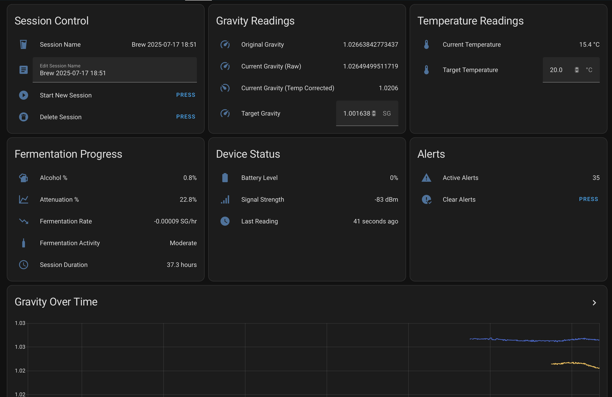

# RAPT Brewing Session Manager

[](https://github.com/sbaird123/rapt-brewing-hacs/releases)
[](https://github.com/sbaird123/rapt-brewing-hacs/commits/main)
[](LICENSE)
[](https://github.com/hacs/integration)

A Home Assistant integration for monitoring brewing sessions with RAPT Pill hydrometers — via direct Bluetooth, existing Home Assistant entities (e.g. a Shelly BLE proxy), or the RAPT cloud API.



*Live dashboard showing a low-alcohol beer fermentation in progress with real-time gravity, temperature, and fermentation metrics. Optimized for both desktop and mobile devices.*

## Features

- **🍺 Session Monitoring**: Start/stop sessions with auto-detection of original gravity, plus browsable session history
- **📊 Advanced Calculations**: Real-time ABV, attenuation, fermentation rate with scientifically accurate temperature correction
- **🌡 Temperature Control**: Drive a heat belt and/or fermentation fridge from the wort temperature, with PWM heating tuned for low-wattage belts and compressor protection for fridges
- **🔔 Smart Alerts**: Configurable stuck fermentation, temperature, completion and low-battery alerts — plus `rapt_brewing_alert` events for automations
- **📡 Three Data Sources**: Direct Bluetooth, Home Assistant entities (BLE proxies), or the RAPT cloud API
- **🔌 Offline Detection**: A connectivity sensor tells you when the Pill stops reporting instead of silently showing stale data
- **🛠 Calibration & Units**: Per-device gravity/temperature offsets and SG or °Plato display
- **🤖 Services**: `start_session`, `stop_session`, and `add_session_note` for scripts and automations
- **📈 Comprehensive Data**: 20+ sensors including accelerometer and fermentation activity
- **📱 Dashboard Ready**: Complete mobile and desktop Lovelace configurations

## Installation

### HACS (Recommended)
1. Open HACS → Integrations → ⋮ → Custom repositories
2. Add `https://github.com/sbaird123/rapt-brewing-hacs` as Integration
3. Install "RAPT Brewing Session Manager" and restart Home Assistant

### Manual Installation
1. Download latest release and extract `rapt_brewing` folder to `custom_components`
2. Restart Home Assistant

## Configuration

**Requirements:** Home Assistant 2024.6.0+, RAPT Pill device

**Setup:** Settings → Devices & Services → Add Integration → Search "RAPT Brewing Session Manager", then pick a data source:

- **Direct Bluetooth** — your HA server (or an ESPHome Bluetooth proxy) hears the Pill directly. Discovered Pills are offered automatically; you can also enter the address manually.
- **Home Assistant entities** — point the integration at existing gravity/temperature/battery sensors (e.g. created by a Shelly BLE gateway).
- **RAPT cloud** — sign in with your RAPT portal email and an API secret (create one at app.rapt.io under Account → API Secrets) and pick your hydrometer. Useful when the Pill is out of Bluetooth range entirely.

After setup, **Configure** offers Notifications, Alert thresholds (including the offline timeout), Display & calibration (SG/°Plato, gravity/temperature offsets), and source entity changes. The **Reconfigure** menu item lets you change the Bluetooth address, source entities, or cloud credentials without losing history.

## Usage

1. **Start Session**: Click "Start New Session" button (auto-creates timestamp name)
2. **Set Parameters**: Original gravity (auto-detected), target gravity, target temperature
3. **Monitor**: Real-time gravity, temperature, ABV%, attenuation%, fermentation rate, temperature-corrected readings
4. **Alerts**: Context-aware notifications for stuck fermentation, temperature issues, low battery

## Dashboard Configuration

The integration provides a comprehensive brewing dashboard with real-time monitoring:

The dashboard shows:
- **Session Control**: Start/stop sessions, edit names, and delete sessions
- **Gravity Readings**: Raw and temperature-corrected gravity values
- **Temperature Monitoring**: Current and target temperatures
- **Fermentation Progress**: Alcohol percentage, attenuation, and fermentation activity
- **Device Status**: Battery level, signal strength, and connection status
- **Alerts**: Active alerts with clear button
- **Historical Charts**: Gravity trends over time showing fermentation progress

### Setup Instructions

**📱 [Desktop Dashboard →](dashboard_config.yaml)** | **📱 [Mobile Dashboard →](dashboard_config_mobile.yaml)**

1. Choose your layout and open the appropriate YAML file
2. Copy the complete YAML configuration
3. In Home Assistant: **Settings** → **Dashboards** → **Your Dashboard**
4. Click **Edit Dashboard** → **Add Card** → **Manual**
5. Paste the YAML and click **Save**

## Available Sensors

**Core Brewing:** Session name, original/current/target gravity (with temperature correction), alcohol %, attenuation %, fermentation rate, temperature

**Device Status:** Battery level, signal strength, session duration, last reading time, active alerts

**Advanced:** Gravity velocity, accelerometer (X/Y/Z), device stability, fermentation activity, firmware version

**📋 [Complete Sensor List →](SENSORS.md)**

## Temperature Correction

The integration uses scientifically accurate temperature correction based on research literature:

### Features
- **Scientific Accuracy**: Uses 0.00013 per °C coefficient from CRC Handbook of Chemistry and Physics
- **True Density Calculation**: Removes thermal expansion/contraction effects to show actual liquid density
- **Brewing-Focused**: Perfect for accurate ABV calculations and fermentation tracking
- **Realistic Corrections**: Small, accurate adjustments (typically ±0.002 SG for normal temperature variations)

### How It Works
- **Cold liquid contracts** → reads artificially HIGH → correction removes thermal contraction effect
- **Warm liquid expands** → reads artificially LOW → correction removes thermal expansion effect
- **Formula**: `True_Density = Raw_Gravity - (Temperature - 20°C) × 0.00013`
- **Result**: Temperature-corrected gravity shows actual fermentation state, not thermal artifacts

## Temperature Control

Configure under **Configure → Temperature control**. Pick the switch that
powers your heat belt, your fermentation fridge, or both, and the integration
adds a `climate` entity that holds the wort at the session's target
temperature. Leave both outputs empty and no thermostat is created.

The setpoint is the session's **Target Temperature**, so the climate card and
the existing number entity always agree, and the setpoint follows the brew.

### Heating: time-proportional, not on/off

A typical fermenter heat belt is 25–50 W and warms the vessel wall, so the
Pill floating in the wort sees a change 30–60 minutes later. Simple on/off
control on that much lag overshoots and wanders, so heating uses a PWM duty
cycle instead:

```
duty = (target - temperature + trim) / proportional_band
```

evaluated once per **cycle window** (default 15 minutes, so at most four
switch operations an hour). A pure proportional loop settles below setpoint —
holding 50% duty needs half the band as permanent error — so a slow integral
**trim** (default 2 hours) removes that droop without fighting the fermenter's
lag. Set the integral time to 0 to disable it.

| Setting | Default | Notes |
|---------|---------|-------|
| Proportional band | 1.0 °C | 100% duty this far below target; narrower = more aggressive |
| Cycle window | 15 min | Pulses shorter than 60 s are rounded away |
| Integral time | 2 h | How fast steady-state droop is trimmed out; 0 disables |

If the duty sits at 100% for two hours with less than 0.2 °C of rise, a
`heater_ineffective` alert fires — the belt is unplugged, or too small for
the ambient temperature.

### Cooling: hysteresis with compressor protection

A fridge is never PWM'd. Cooling starts when the wort is above target plus the
**deadband** and runs until it reaches target, subject to minimum on and off
times.

| Setting | Default | Notes |
|---------|---------|-------|
| Deadband | 0.5 °C | How far above target before the fridge starts |
| Minimum on | 3 min | Avoids very short compressor runs |
| Minimum off | 5 min | Short-cycle protection — do not set this to 0 |

### Safety

Heating and cooling can never run together, and a **changeover deadtime**
(default 10 minutes) stops them fighting across a swing. The heater also
switches off when:

- the wort exceeds target + **max overshoot** (default 2.0 °C)
- the wort reaches the **absolute maximum** (default 30 °C) regardless of setpoint
- the Pill goes offline or its readings go stale
- no session is active, or the session is stopped
- the integration is reloaded, removed, or the entity is deleted

### Which mode?

A new thermostat starts in the mode its outputs imply — `heat` with only a
belt, `cool` with only a fridge, `heat_cool` with both — so configuring an
output is all it takes to start controlling. Switch it to `off` (or pick a
different mode) on the card at any time; your choice survives a restart, and
the outputs are re-read at startup and brought back in line on the first tick.

> **Not using this integration's thermostat?** Home Assistant's built-in
> `generic_thermostat` can drive a switch from any of the temperature sensors
> here. It has no session awareness, no offline failsafe and no PWM heating,
> but it is a fine minimal option.

## Alerts & Notifications

### Alert Types
All thresholds are configurable under **Configure → Alert thresholds** (defaults shown):
- **Stuck Fermentation**: No gravity change for 48+ hours (once per session)
- **Temperature High**: Above 30°C (86°F) during fermentation (once per hour)
- **Temperature Low**: Below 10°C (50°F) during early/mid fermentation only (cold crash at 70%+ attenuation is expected)
- **Fermentation Complete**: Target gravity reached (once per session)
- **Low Battery**: Below 20% (only after battery calibration)
- **Heater Ineffective**: Heating at 100% duty for 2 hours with no meaningful temperature rise (once per session; requires temperature control)

Every alert also fires a `rapt_brewing_alert` event on the Home Assistant bus
(`alert_type`, `message`, `session_id`, `session_name`, `entry_id`), so you can
build automations like:

```yaml
automation:
  - alias: Chill on high ferment temperature
    trigger:
      - platform: event
        event_type: rapt_brewing_alert
        event_data:
          alert_type: temperature_high
    action:
      - service: switch.turn_on
        target:
          entity_id: switch.glycol_chiller
```

### Notification Configuration
Alerts automatically create Home Assistant persistent notifications in the UI. For external notifications:

#### ✅ Built-in Notification Service (Recommended - Easy!)
First, ensure you have a notification service configured (mobile app, Telegram, email, etc.). Then:

1. Go to **Settings** → **Devices & Services** → **RAPT Brewing Session Manager**
2. Click **Configure**
3. Select your notification service from the dropdown (e.g., `notify.mobile_app_your_phone`)
4. Click **Submit**

**Done!** The integration automatically sends alerts to your chosen notification service with rich data including alert type, session name, and brewing status.

## Services

For scripts and automations (all accept an optional `device_id` when you have multiple entries):

```yaml
service: rapt_brewing.start_session
data:
  session_name: "West Coast IPA"
  recipe: "Cascade + Citra"
  target_gravity: 1.012
  target_temperature: 19
```

`rapt_brewing.stop_session` stops the current session, and
`rapt_brewing.add_session_note` appends a timestamped note to it.

## Troubleshooting

### Common Issues

**Integration won't load**
- Verify Bluetooth is enabled on your Home Assistant server
- Check that your RAPT Pill is broadcasting (manufacturer IDs 16722 or 17739)
- Review Home Assistant logs for errors

**No data updates**
- Ensure RAPT Pill is powered on and broadcasting BLE advertisements
- Check Bluetooth range (ESPHome BLE proxies recommended for better range)
- Verify integration is receiving BLE advertisements in logs

**Incorrect calculations**
- Confirm original gravity is set correctly
- Check target gravity values
- Ensure sufficient data points for rate calculations

## License

This project is licensed under the MIT License - see the [LICENSE](LICENSE) file for details.

**Issues & Support:**
- [GitHub Issues](https://github.com/sbaird123/rapt-brewing-hacs/issues)
- [GitHub Discussions](https://github.com/sbaird123/rapt-brewing-hacs/discussions)
- [Home Assistant Community](https://community.home-assistant.io/)